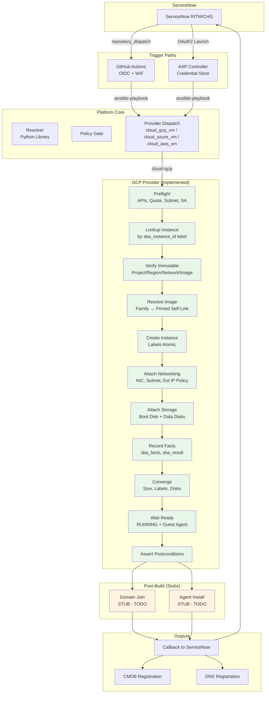
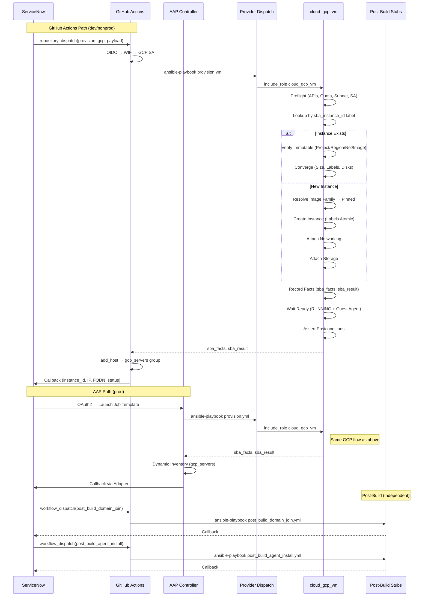
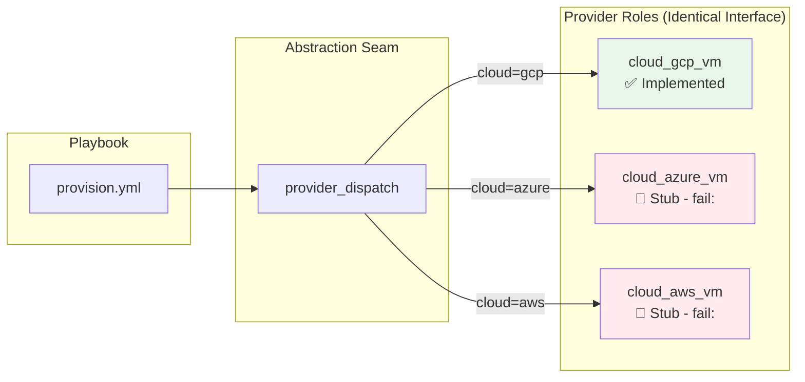

# Server Build Automation Platform

**Phase 1: GCP-Only VM Provisioning — Implementation Complete**

Enterprise, multi-cloud, ServiceNow-integrated server provisioning automation.
Phase 1 delivers **full GCP implementation** with Azure/AWS as interface stubs for future phases.

---

## Architecture Overview



---

## Request Lifecycle Sequence



---

## Provider Abstraction



**Contract (8 Variables — Identical Across All Providers):**
| Variable | Type | Required | Description |
|---|---|---|---|
| `cloud` | string | ✅ | `gcp` \| `azure` \| `aws` |
| `environment` | string | ✅ | `dev` \| `staging` \| `prod` |
| `os_family` | string | ✅ | `rhel9` \| `ubuntu2204` \| `windows2022` |
| `app_tier` | string | ✅ | `web` \| `app` \| `db` |
| `vm_count` | integer | ✅ | 1-20 |
| `requestor` | string | ✅ | ServiceNow user |
| `change_ticket` | string | ✅ | ServiceNow CHG number |
| `expiry_date` | string | ❌ | YYYY-MM-DD (optional) |

---

## GCP Implementation Details

### Collections (Pinned)
- `google.cloud` 1.14.0
- `community.general` 8.6.0
- `ansible.posix` 1.5.4
- `ansible.utils` 6.1.1

### Core Module
- `google.cloud.gcp_compute_instance` — Direct instance management (not template + MIG)
- Image resolution: Family → Pinned self_link at provision time
- Networking: Subnet from `gcp_subnet_map[environment][app_tier]`
- Auth: Workload Identity Federation (GitHub Actions) / AAP Credential (AAP)

### Tagging (via `roles/common/tagging_gcp`)
**Labels (Immutable — Applied at Create):**
- `owner` → `requestor`
- `cost_center` → Derived from `app_tier` + `environment`
- `environment` → `environment`
- `change_ticket` → `change_ticket`
- `expiry` → `expiry_date` (optional)
- `sba_instance_id` → UUID (primary lookup key)

**Annotations (Mutable — Applied Post-Create):**
- `requestor`, `change_ticket`, `provisioned_at`, `provisioned_by`, `sba_run_id`

### Idempotency
- `state: present` on all `gcp_compute_instance` tasks
- Lookup by `sba_instance_id` label (not name)
- `verify_immutable` asserts project/region/network/image match
- `converge` updates only mutable attributes
- Destroy only if `adopted: false`

---

## Repository Structure (Phase 1)

```
server-build-automation/
├── .github/workflows/
│   ├── provision-gcp.yml              # Reusable workflow (OIDC, lint, provision, callback)
│   └── provision-gcp-dispatch.yml     # ServiceNow dispatch wrapper
├── automation/aap/
│   ├── credentials/gcp_service_account.yml
│   ├── inventories/gcp_dynamic.yml
│   ├── job_templates/
│   │   ├── provision_gcp.yml
│   │   ├── post_build_domain_join.yml
│   │   └── post_build_agent_install.yml
│   └── workflow_templates/full_build_gcp.yml
├── playbooks/
│   ├── provision.yml                  # GCP entry point
│   ├── post_build_domain_join.yml     # Independent, targets gcp_servers
│   └── post_build_agent_install.yml   # Independent, targets gcp_servers
├── roles/
│   ├── provider_dispatch/             # Routes gcp→cloud_gcp_vm, fails for others
│   ├── cloud_gcp_vm/                  # Full GCP implementation (12 tasks, Molecule)
│   ├── cloud_azure_vm/                # Stub with fail: + identical interface
│   ├── cloud_aws_vm/                  # Stub with fail: + identical interface
│   ├── common/tagging_gcp/            # Shared label/annotation enforcement
│   ├── postbuild_domain_join/         # Stub with TODO list
│   └── postbuild_agent_install/       # Stub with TODO list
├── group_vars/all/
│   ├── input_schema.yml               # 8-variable validation schema
│   ├── gcp_project_map.yml
│   ├── gcp_region_map.yml
│   ├── gcp_image_family_map.yml
│   ├── gcp_subnet_map.yml
│   ├── gcp_machine_type_map.yml
│   ├── gcp_zone_map.yml
│   └── gcp_tag_policy.yml
├── schemas/
│   └── gcp-input-vars.schema.json     # JSONSchema for 8 variables
├── docs/
│   ├── PLAN.md                        # Project plan with deliverables
│   ├── DECISIONS.md                   # 20 architectural decisions (AD-01 to AD-20)
│   ├── servicenow_contract.md         # Payload, auth, response, error codes
│   └── architecture/                  # Provider abstraction, role model, etc.
└── collections/requirements.yml       # Pinned collections
```

---

## Quick Start

### Prerequisites
- GCP project with Compute API enabled
- Golden image families published (e.g., `projects/sbagoldimages/global/images/family/rhel-9-gold`)
- VPC, subnets, firewall rules pre-configured
- Service account with `roles/compute.instanceAdmin`, `roles/iam.serviceAccountUser`
- Workload Identity Federation pool/provider for GitHub Actions

### GitHub Actions Setup
1. Create WIF pool/provider in GCP
2. Add GitHub repo as workload identity principal
3. Grant service account impersonation permission
4. Add secrets to GitHub repo:
   - `GCP_WORKLOAD_IDENTITY_PROVIDER`
   - `GCP_SERVICE_ACCOUNT_EMAIL`
   - `GCP_PROJECT_ID`
   - `SERVICENOW_CALLBACK_TOKEN` (optional)
   - Domain join / agent secrets (optional)

### Local Development
```bash
# Install collections
ansible-galaxy collection install -r collections/requirements.yml -p collections/

# Authenticate to GCP
gcloud auth application-default login

# Run provision playbook
ansible-playbook playbooks/provision.yml \
  -e cloud=gcp \
  -e environment=dev \
  -e os_family=rhel9 \
  -e app_tier=web \
  -e vm_count=1 \
  -e requestor=john.doe \
  -e change_ticket=CHG0012345
```

### Run Tests
```bash
# Lint
ansible-lint --profile production playbooks/provision.yml
yamllint .
gitleaks detect --source .

# Molecule (cloud_gcp_vm)
cd roles/cloud_gcp_vm && molecule test -s default
```

---

## Documentation

| Document | Description |
|---|---|
| [docs/PLAN.md](docs/PLAN.md) | Project plan with deliverables, timeline, risks |
| [docs/DECISIONS.md](docs/DECISIONS.md) | 20 architectural decisions (AD-01 to AD-20) |
| [docs/servicenow_contract.md](docs/servicenow_contract.md) | ServiceNow payload, auth, callback, error codes |
| [docs/architecture/provider-abstraction.md](docs/architecture/provider-abstraction.md) | Provider contract, 4 operations, 6 task groups |
| [docs/architecture/role-dependency-model.md](docs/architecture/role-dependency-model.md) | Role taxonomy, dependencies, provider contract |
| [docs/architecture/architectural-decisions.md](docs/architecture/architectural-decisions.md) | All ADs with rationale |

---

## Phase 1 Status

| Component | Status |
|---|---|
| GCP Provider (`cloud_gcp_vm`) | ✅ Implemented (12 task files, Molecule tests) |
| Provider Dispatch | ✅ Implemented (routes GCP, fails Azure/AWS) |
| Azure/AWS Stubs | ✅ Created (identical interface, fail: task) |
| Lookup Tables (`group_vars/all/`) | ✅ 7 GCP maps + input schema |
| Provision Playbook | ✅ Implemented |
| Post-Build Playbooks | ✅ Created (stubs with TODO) |
| GitHub Actions | ✅ Reusable workflow + dispatch wrapper |
| AAP Templates | ✅ Credentials, inventory, job templates, workflow |
| ServiceNow Contract | ✅ Documented |
| Lint Gates | ✅ ansible-lint, yamllint, gitleaks, checkov |

---

## Open Questions (Track in `docs/DECISIONS.md`)

| ID | Question |
|---|---|
| Q1 | Instance template + MIG for `vm_count` > 1? |
| Q2 | Exact `sba_name` naming convention (≤15 chars)? |
| Q3 | `sba_instance_id` generation algorithm? |
| Q4 | Image family vs pinned image in map? |
| Q5 | `cost_center` derivation logic? |
| Q6 | Domain join tooling (realm/sssd vs adcli vs PowerShell)? |
| Q7 | Agent choice (Dynatrace/Datadog/CrowdStrike)? |
| Q8 | Auto-decommission on `expiry_date`? |
| Q9 | Windows on GCP specifics? |

---

## Future Provider Extension (Phase 2+)

To add a new provider (OCI, vSphere, IBM, Alibaba):

1. Create `roles/cloud_<provider>_vm/` with identical `meta/argument_specs.yml`
2. Implement 6 task groups per provider contract
3. Add lookup tables in `group_vars/all/`
4. Update `provider_dispatch` routing map
5. Add collections to `collections/requirements.yml`
6. Add GitHub Actions workflow + AAP templates
7. Update `provider_matrix.yml`

See [docs/PLAN.md §9](docs/PLAN.md#9-future-provider-extension-points-phase-2) for details.

---

## License

MIT — See [LICENSE](LICENSE) for details.
